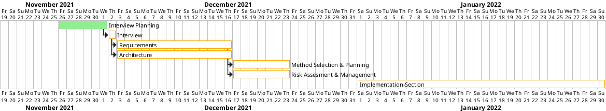
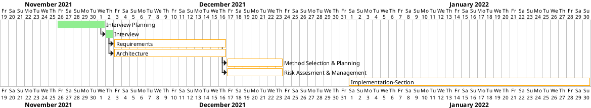
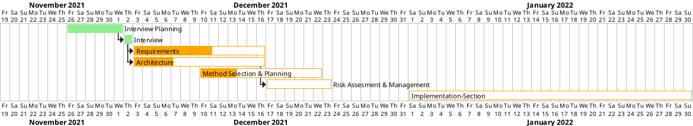

# Source for Gantt Chart

## 26-Nov-2021

```plantuml
@startgantt
[Interview Planning] lasts 6 days
[Interview Planning] is 100% complete
[Interview Planning] is colored in lightgreen

[Interview] lasts 1 day
[Interview] is 0% complete
[Interview] is colored in orange

[Requirements] lasts 14 days
[Requirements] is colored in orange
[Requirements] is 0% complete

[Architecture] lasts 14 days
[Architecture] is colored in orange
[Architecture] is 0% complete

[Method Selection & Planning] lasts 7 days
[Method Selection & Planning] is colored in orange
[Method Selection & Planning] is 0% complete

[Risk Assesment & Management] lasts 7 days
[Risk Assesment & Management] is colored in orange
[Risk Assesment & Management] is 0% complete

[Implementation-Section] lasts 30 days
[Implementation-Section] is colored in orange
[Implementation-Section] is 0% complete


Project starts 2021-11-19
[Interview Planning] starts 2021-11-26
[Interview] starts at [Interview Planning]'s end
[Requirements] starts at [Interview]'s end
[Architecture] starts at [Interview]'s end
[Method Selection & Planning] starts at [Requirements]'s end
[Risk Assesment & Management] starts at [Architecture]'s end
[Implementation-Section] starts 2022-1-1
@endgantt
```

## 3-Dec-2021

```plantuml
@startgantt
[Interview Planning] lasts 6 days
[Interview Planning] is 100% complete
[Interview Planning] is colored in lightgreen

[Interview] lasts 1 day
[Interview] is 100% complete
[Interview] is colored in lightgreen

[Requirements] lasts 14 days
[Requirements] is colored in orange
[Requirements] is 0% complete

[Architecture] lasts 14 days
[Architecture] is colored in orange
[Architecture] is 0% complete

[Method Selection & Planning] lasts 7 days
[Method Selection & Planning] is colored in orange
[Method Selection & Planning] is 0% complete

[Risk Assesment & Management] lasts 7 days
[Risk Assesment & Management] is colored in orange
[Risk Assesment & Management] is 0% complete

[Implementation-Section] lasts 30 days
[Implementation-Section] is colored in orange
[Implementation-Section] is 0% complete


Project starts 2021-11-19
[Interview Planning] starts 2021-11-26
[Interview] starts at [Interview Planning]'s end
[Requirements] starts at [Interview]'s end
[Architecture] starts at [Interview]'s end
[Method Selection & Planning] starts at [Requirements]'s end
[Risk Assesment & Management] starts at [Architecture]'s end
[Implementation-Section] starts 2022-1-1
@endgantt
```

## 10-Dec-2021

```plantuml
@startgantt
[Interview Planning] lasts 6 days
[Interview Planning] is 100% complete
[Interview Planning] is colored in lightgreen

[Interview] lasts 1 day
[Interview] is 100% complete
[Interview] is colored in lightgreen

[Requirements] lasts 14 days
[Requirements] is 60% complete
[Requirements] is colored in orange

[Architecture] lasts 14 days
[Architecture] is 30% complete
[Architecture] is colored in orange

[Method Selection & Planning] lasts 13 days
[Method Selection & Planning] is 30% complete
[Method Selection & Planning] is colored in orange

[Risk Assesment & Management] lasts 7 days
[Risk Assesment & Management] is colored in orange
[Risk Assesment & Management] is 0% complete

[Implementation-Section] lasts 30 days
[Implementation-Section] is colored in orange
[Implementation-Section] is 0% complete


Project starts 2021-11-19
[Interview Planning] starts 2021-11-26
[Interview] starts at [Interview Planning]'s end
[Requirements] starts at [Interview]'s end
[Architecture] starts at [Interview]'s end
[Method Selection & Planning] starts 2021-12-10
[Risk Assesment & Management] starts at [Architecture]'s end
[Implementation-Section] starts 2022-1-1
@endgantt
```
