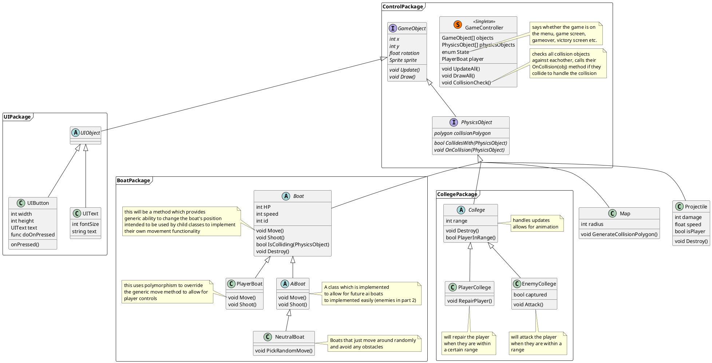

# General Diagram Planning

```plantuml
@startuml

skinparam groupInheritance 3

package ControlPackage <<frame>>{
interface GameObject{
{abstract} int x
{abstract} int y
{abstract} float rotation
{abstract} Sprite sprite
{abstract} void Update()
{abstract} void Draw()
}

interface PhysicsObject{
{abstract} polygon collisionPolygon
{abstract} bool CollidesWith(PhysicsObject)
{abstract} void OnCollision(PhysicsObject)
}

class GameController << (S,#FF7700) Singleton >>{
	GameObject[] objects
	PhysicsObject[] physicsObjects
	enum State
	PlayerBoat player

	void UpdateAll()
	void DrawAll()
	void CollisionCheck()
}

note right of GameController::State
says whether the game is on
the menu, game screen, 
gameover, victory screen etc.
end note

note right of GameController::CollisionCheck
checks all collision objects
against eachother, calls their
OnCollision(obj) method if they
collide to handle the collision
end note

GameObject <|-- PhysicsObject
}
package BoatPackage <<frame>>{
abstract Boat{
	int HP
	int speed
	int id

    void Move()
    void Shoot()
    bool IsColliding(PhysicsObject)
	void Destroy()
}

note left of Boat::Move
this will be a method which provides
generic ability to change the boat's position
intended to be used by child classes to implement
their own movement functionality
endnote

class PlayerBoat{
    void Move()
	void Shoot()
}

note left of PlayerBoat::Move
this uses polymorphism to override 
the generic move method to allow for
player controls
endnote

abstract class AiBoat{
	void Move()
	void Shoot()
}

note right of AiBoat 
A class which is implemented
to allow for future ai boats 
to implemented easily (enemies in part 2)
end note

class NeutralBoat{
	void PickRandomMove()
}

note right of NeutralBoat
Boats that just move around randomly
and avoid any obstacles
end note

PhysicsObject <|-- Boat
Boat <|-- PlayerBoat
Boat <|-- AiBoat
AiBoat <|-- NeutralBoat

}


package CollegePackage <<frame>>{
abstract College{
	int range

	void Destroy()
	bool PlayerInRange()
}

note right of College
handles updates
allows for animation
end note

class PlayerCollege{
	void RepairPlayer()
}
note bottom of PlayerCollege
will repair the player
when they are within
a certain range
end note

class EnemyCollege{
	bool captured
	void Attack()
}

note bottom of EnemyCollege
will attack the player
when they are within a
range
end note

PhysicsObject <|-- College
College <|-- PlayerCollege
College <|-- EnemyCollege
}


class Map{
	int radius
	void GenerateCollisionPolygon()
}
PhysicsObject <|-- Map

class Projectile{
	int damage
	float speed
	bool isPlayer

	void Destroy()
}

PhysicsObject <|-- Projectile

package UIPackage <<frame>>{
abstract UIObject{
}
class UIButton{
	int width
	int height
	UIText text
	func doOnPressed
	onPressed()
}

class UIText{
	int fontSize
	string text
}

GameObject <|-- UIObject
UIObject <|-- UIButton
UIObject <|-- UIText
}

@enduml
```
