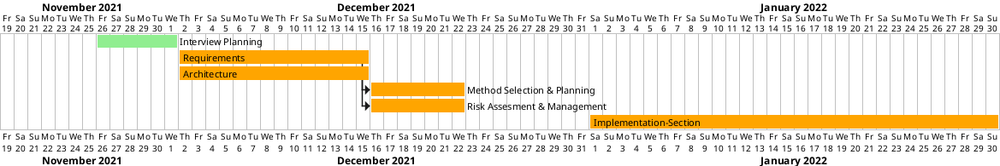

testtesttesttest

Snapshot 23/11/21:
The project board has been created and we're in the middle of fleshing out the website, primarily by including navigation between pages

# Weekly Gantt Chart Snapshots

## 26-11-2021

